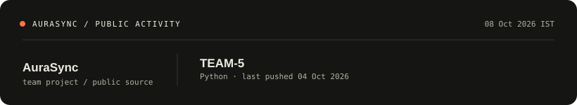

I'm Praneeth. I build web apps and work on AI projects. I was a full-stack intern at **Pupilfirst**, where I also contributed to the [CARE healthcare platform](https://github.com/ohcnetwork/care_fe/pulls?q=is%3Apr+author%3AGSMPRANEETH+is%3Amerged).

Away from the keyboard, I run and edit videos in **DaVinci Resolve**, including projects made with friends.

[Portfolio ↗](https://gsmpraneeth.netlify.app) · [LinkedIn](https://www.linkedin.com/in/gsmpraneeth/) · [Email](mailto:praneethgsm47@gmail.com) · [CodeChef](https://www.codechef.com/users/gsmpraneeth)

### A few things I've worked on

| Project | What it does / my part |
| :--- | :--- |
| [**AuraSync**](https://github.com/GSMPRANEETH/TEAM-5) | A team-built speech-analysis prototype. I worked on pipeline integration, retrieval and output guardrails. |
| [**Sportify**](https://github.com/GSMPRANEETH/capstone3) · [demo](https://sportify-cp3.netlify.app/) | A React sports dashboard with favorites and preferences. A capstone built with course-provided demo APIs. |
| [**LMS Portal**](https://github.com/GSMPRANEETH/capstone2) | Courses, quizzes and progress tracking, with separate student and educator workflows. Node.js, Express and PostgreSQL. |
| [**Doom Scroll Blocker**](https://github.com/GSMPRANEETH/extension) | A Chrome extension that spots long scrolling sessions and offers configurable reminders. |

Also: a [camera marker scanner](https://github.com/GSMPRANEETH/alemeno_) and a [React Native product catalog](https://github.com/GSMPRANEETH/reactnativefesher).

**Tools I use:** `React` · `TypeScript` · `Python` · `FastAPI` · `Node.js` · `PostgreSQL` · `Docker`

### From my public repositories

<!-- recent-work:start -->

- [extension](https://github.com/GSMPRANEETH/extension) — last pushed 06 Sep 2026
- [wd201](https://github.com/GSMPRANEETH/wd201) — last pushed 06 Sep 2026
- [capstone2](https://github.com/GSMPRANEETH/capstone2) — last pushed 06 Sep 2026

<!-- recent-work:end -->

Updated daily by [GitHub Actions](https://github.com/GSMPRANEETH/GSMPRANEETH/actions/workflows/refresh-profile.yml). These are repository push dates, not a measure of hours worked. [How it updates](./scripts/refresh-profile.py).
